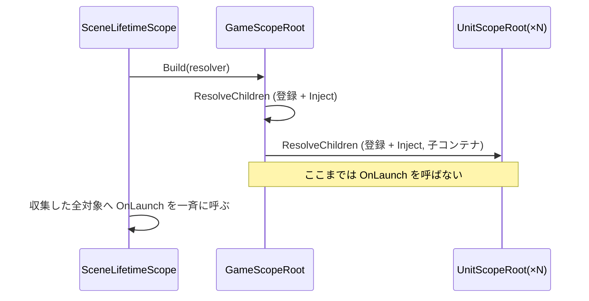
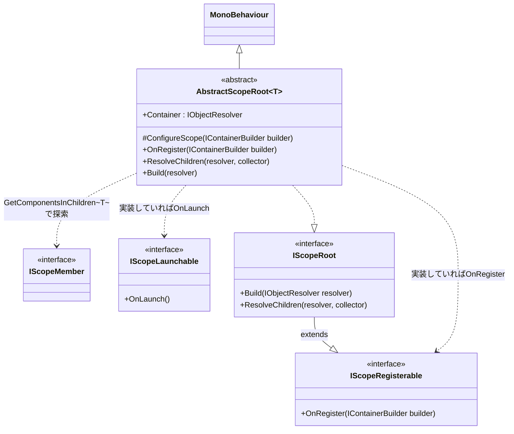
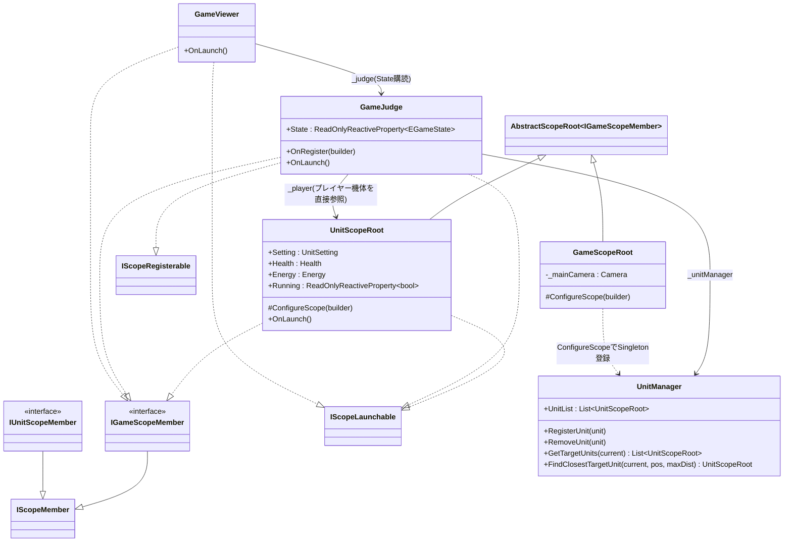
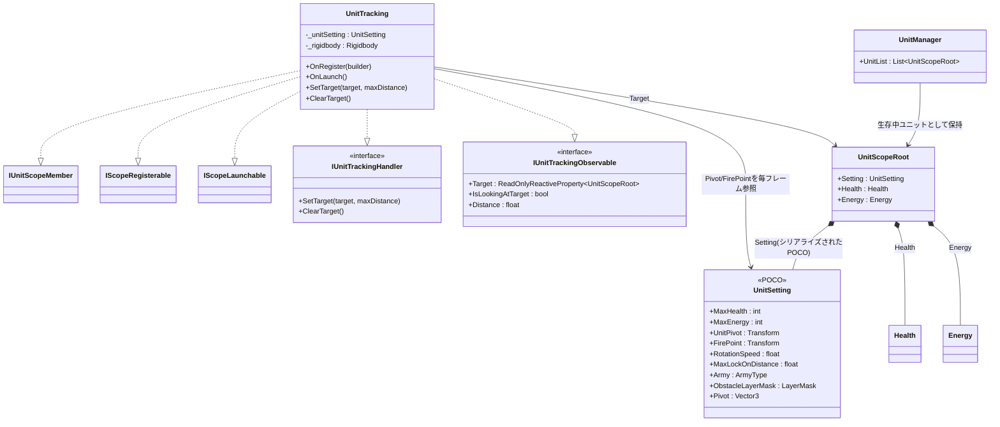
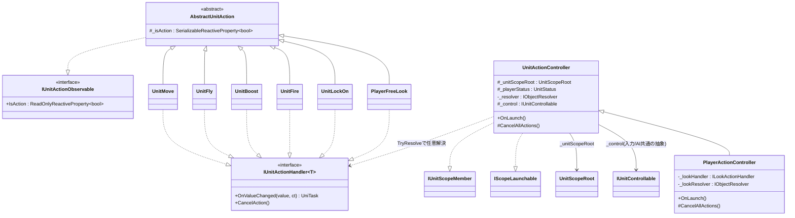
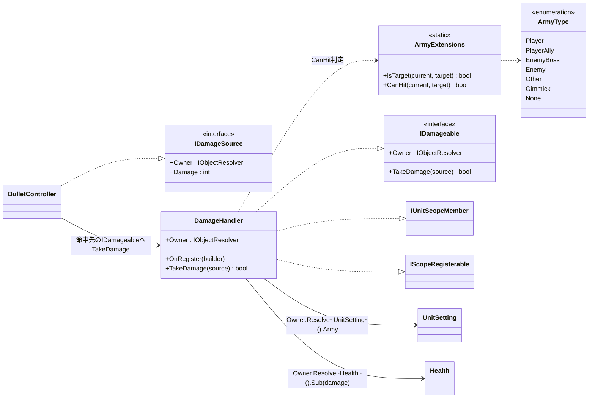

# 3DRobotGame 設計ドキュメント

Unity製メカ対戦ゲーム。VContainer + R3(Rx)ベースのDIアーキテクチャを採用している。
このドキュメントは、教材として現在のコード構成・設計方針を説明するためのもの。

## 目次

1. [全体構成](#全体構成)
2. [スコープ/DIアーキテクチャ (MyUtils.VContainerExtensions)](#スコープdiアーキテクチャ-myutilsvcontainerextensions)
3. [シーン構成とスコープツリー](#シーン構成とスコープツリー)
4. [Unit(機体)まわりの設計](#unit機体まわりの設計)
5. [アクション制御 (UnitActionController)](#アクション制御-unitactioncontroller)
6. [戦闘システム (Army / ダメージ)](#戦闘システム-army--ダメージ)
7. [ゲーム進行 (GameJudge / GameViewer)](#ゲーム進行-gamejudge--gameviewer)
8. [コーディング規約・設計方針](#コーディング規約設計方針)
9. [既知の注意点](#既知の注意点)

---

## 全体構成

```
_Projects/Features/
├── Root/    RootLifetimeScope … シーン全体のVContainerエントリーポイント
├── Game/    GameScopeRoot / GameJudge / GameViewer … ゲーム進行・全体管理
├── Unit/    UnitScopeRoot 以下、機体1体分のロジック一式
│   ├── Player/  … プレイヤー機体固有の入力・UI
│   ├── Enemy/   … 敵AI
│   └── Battle/  … 陣営・ダメージ・弾
└── Input/   PlayerInputReader … Input System経由の入力取得
```

依存関係は「1体の機体(Unit)」を単位にまとまっており、`UnitScopeRoot` が機体ごとに
独立したDIコンテナ(子スコープ)を持つ。これにより、機体固有のコンポーネント同士は
シーンに何体並んでいても正しく「同じ機体の中の依存」だけを解決できる。

## スコープ/DIアーキテクチャ (MyUtils.VContainerExtensions)

VContainerそのものではなく、**GameObject階層をスキャンして自動的にDI登録する薄い拡張層**を
`MyUtils` パッケージ側に実装している(`AbstractScopeRoot<T>`)。狙いは以下の3点:

- 子機能(コンポーネント)は、自分でコンテナに登録するかどうかを自分で選べる
- 子機能を追加するたびに、`LifetimeScope` や `ScopeRoot` 側の修正は不要にする
- 全ての依存関係が解決し終えたタイミングで、まとめて開始処理を呼びたい

### 3つのマーカーインターフェース

```csharp
// 「このスコープの探索対象である」ことを示すだけの空マーカー
public interface IScopeMember { }

// 親コンテナへの自己登録が必要なら実装する(任意)
public interface IScopeRegisterable
{
    void OnRegister(IContainerBuilder builder);
}

// スコープツリー全体の登録・Inject解決が完了した後、1回だけ呼ばれる(任意)
public interface IScopeLaunchable
{
    void OnLaunch();
}
```

`IScopeMember` を実装しているだけのコンポーネントは、それだけで
`AbstractScopeRoot<T>.GetComponentsInChildren<T>()` によって自動的に見つかり、
**登録の有無に関係なく** VContainerの `IObjectResolver.Inject(object)` によって
`[Inject]` フィールドの依存解決を受けられる。「登録は必須ではないが依存は受け取れる」
という非対称な設計が肝。

`OnRegister` を実装した場合だけ、親コンテナ(このスコープが作る子コンテナ)へ
`builder.RegisterComponent(this)` のような形で自分自身を登録できる。
これにより、他のコンポーネントから `[Inject]` で参照されたり `IObjectResolver.Resolve<T>()`
で解決されたりできるようになる(=依存を「提供する側」に回れる)。

`OnLaunch` を実装した場合は、スコープツリー全体の構築が終わったあとにまとめて呼ばれる。
Rx購読の開始など「他の依存が全部揃っていないとできない処理」はここで行う。

### AbstractScopeRoot&lt;T&gt; の処理の流れ

```csharp
public abstract class AbstractScopeRoot<T> : MonoBehaviour, IScopeRoot
    where T : IScopeMember
```

型引数 `T` が「このスコープ配下で探索するマーカーインターフェース」を表す
(`IUnitScopeMember` なら機体単位、`IGameScopeMember` ならゲーム全体単位)。

1. **`ResolveChildren`**: 自身の子孫から `T` を実装するコンポーネントを
   `GetComponentsInChildren<T>()` で全て収集し、子コンテナ(`resolver.CreateScope`)を作る
2. 収集した対象のうち `IScopeRegisterable` を実装するものだけ `OnRegister` を呼んで登録
3. **登録の有無を問わず全員に** `Container.Inject(target)` を呼び、`[Inject]` フィールドを解決
4. 収集した対象の中にネストした `IScopeRoot`(=別の `AbstractScopeRoot<T>`)がいれば、
   そのスコープの子コンテナを親として再帰的に `ResolveChildren` を呼ぶ(スコープの入れ子)
5. **`Build`**(ツリーの最上位からのみ呼ぶ): `ResolveChildren` で集めた全対象に対し、
   最後にまとめて `IScopeLaunchable.OnLaunch()` を呼ぶ



この「登録・Inject解決」と「OnLaunch実行」を完全に2フェーズへ分離しているのが要点。
1フェーズで混ぜてしまうと、初期化順序に依存した `NullReferenceException` が起きやすい
(あるコンポーネントの `OnLaunch` が、まだ `[Inject]` されていない別コンポーネントを
参照してしまう、など)。VContainer標準の `IInitializable` / `IStartable` 等と役割が
似ているが、名前の衝突を避けるために独自名(`IScopeLaunchable.OnLaunch`)にしている。

### クラス図



`T` は「探索対象のマーカーインターフェース」であって継承関係ではないため、
`AbstractScopeRoot<T>` から `IScopeMember` へは依存(点線矢印)として表現している。
`IScopeRegisterable` / `IScopeLaunchable` は `AbstractScopeRoot<T>` が実行時に
`is` 判定で呼び分けるだけで、実装は完全に任意(実装しなくてもエラーにならない)。

### なぜVContainerを直接使わないのか

VContainerは「型ごとに `builder.Register<T>()` を書く」のが基本だが、この方式だと
機体を1体増やすたびに登録コードを増やす必要が出てくる。`AbstractScopeRoot<T>` は
「シーンに置いたコンポーネントを型(マーカーインターフェース)で自動収集して登録する」
ことで、機体の追加・削除がシーンの編集だけで完結するようにしている
(コード側の修正が不要)。

## シーン構成とスコープツリー

```
RootLifetimeScope (VContainer標準のLifetimeScope。ルートコンテナのみ作る)
└── GameScopeRoot : AbstractScopeRoot<IGameScopeMember>
    ├── Camera(_mainCamera) … ConfigureScopeで登録
    ├── UnitManager … ConfigureScopeでSingleton登録
    ├── GameJudge : IGameScopeMember, IScopeRegisterable, IScopeLaunchable
    ├── GameViewer : IGameScopeMember, IScopeLaunchable
    └── UnitScopeRoot(×18): IGameScopeMember, IScopeLaunchable  ← ここがネストしたIScopeRoot
        └── UnitScopeRoot配下の各コンポーネント : IUnitScopeMember
            (UnitTracking, UnitActionController, DamageHandler, ...)
```

- `GameScopeRoot` は `IGameScopeMember` を実装するもの全てを探索する
- `UnitScopeRoot` 自身も `IGameScopeMember` を実装しているため、`GameScopeRoot` から
  見つかる。かつ `UnitScopeRoot` は `AbstractScopeRoot<IUnitScopeMember>` でもあるため、
  `IScopeRoot` として認識され、**自分の子コンテナを別途作って** 機体配下の
  `IUnitScopeMember` を再帰的に解決する
- つまり「機体固有の依存」(`Rigidbody` / `UnitSetting` / `Health` / `Energy` など)は
  機体ごとの子コンテナにしか登録されず、他の機体から誤って解決されることがない

### クラス図



`GameScopeRoot` は `IGameScopeMember` を実装する全コンポーネントを探索するが、
`UnitScopeRoot` 自身もその1つでありながら**同時に別の `AbstractScopeRoot<IUnitScopeMember>`
でもある**ため、図の上では「`GameScopeRoot` に見つかる存在」と
「`IUnitScopeMember` を探索するスコープルート」という2つの役割を1クラスが持つ形になる。

## Unit(機体)まわりの設計

### UnitScopeRoot

機体1体の「ルート」。`AbstractScopeRoot<IUnitScopeMember>` を継承し、機体配下の
全コンポーネントのスコープ境界を担う。同時に `Health` / `Energy` / `Setting` への
アクセスを **プロパティとして直接公開**しており、他クラスから
`Container.Resolve<Health>()` のような間接参照をせずに `unit.Health` と書ける
(可読性のための意図的な設計)。

```csharp
public class UnitScopeRoot : AbstractScopeRoot<IUnitScopeMember>, IGameScopeMember, IScopeLaunchable
{
    [field: SerializeField] public UnitSetting Setting { get; private set; }
    [field: SerializeField] public Health Health { get; private set; }
    [field: SerializeField] public Energy Energy { get; private set; }

    private void Awake()
    {
        // UnitSettingの数値設定を、実行時の状態(Health/Energy)へ反映
        Health.SetMax(Setting.MaxHealth);
        Health.SetFull();
        Energy.SetMax(Setting.MaxEnergy);
        Energy.SetFull();
    }

    public void OnLaunch()
    {
        // 体力が0でなく、かつゲーム進行中のみアクション可能、を条件に Running を更新
        // 体力が0になったらUnitManagerから削除する
    }

    protected override void ConfigureScope(IContainerBuilder builder)
    {
        base.ConfigureScope(builder);
        builder.RegisterComponent(this);
        builder.RegisterInstance(Setting);   // UnitSettingはPOCOなのでRegisterInstance
        builder.RegisterComponent(_rigidbody);
        builder.RegisterComponent(_groundDetection);
        builder.RegisterComponent(Health);
        builder.RegisterComponent(Energy);
    }
}
```

### UnitSetting — MonoBehaviourではなく素のPOCO

`UnitSetting` は機体の静的な設定値(最大体力・最大エネルギー・回転速度・陣営・
UnitPivot/FirePointの参照Transformなど)をまとめた **`[System.Serializable]` の
ただのクラス**であり、`MonoBehaviour` ではない。`UnitScopeRoot` のフィールドとして
`[field: SerializeField]` でインスペクターに直接展開される。

```csharp
[System.Serializable]
public class UnitSetting
{
    [field: SerializeField] public int MaxHealth { get; private set; } = 5000;
    [field: SerializeField] public Transform UnitPivot { get; private set; }
    [field: SerializeField] public Transform FirePoint { get; private set; }
    [field: SerializeField] public float RotationSpeed { get; private set; } = 400f;
    [field: SerializeField] public ArmyType Army { get; private set; } = ArmyType.Player;
    // ...
    public Vector3 Pivot => UnitPivot.position;
}
```

以前は `IUnitScopeMember` を実装する独立コンポーネントだったが、「1つのGameObjectに
コンポーネントを増やさなくても済む」「値渡しの設定データに `GetComponent` は不要」という
理由でPOCO化した。コンテナへは `builder.RegisterInstance(Setting)` で登録し、
機体配下の各コンポーネントは通常どおり `[Inject] private UnitSetting _unitSetting;` で
受け取れる。

> **注意**: POCO化した際、シーン上のインスペクター参照(`UnitPivot`/`FirePoint`などの
> Transform参照や、`RotationSpeed`/`Army`などの数値)は自動的には引き継がれない。
> 詳しくは[既知の注意点](#既知の注意点)を参照。

### UnitManager

シーン上の生存中ユニット一覧を保持するシングルトン(MonoBehaviourではない、
`GameScopeRoot.ConfigureScope` で `builder.Register<UnitManager>(Lifetime.Singleton)` 登録)。
登録・削除をR3の `Subject` で通知し、陣営(`ArmyType`)に基づく索敵(`GetTargetUnits` /
`FindClosestTargetUnit`)を提供する。

### UnitTracking

「指定されたTargetの方向を体(水平のみ)とFirePoint(全方位)で向き続ける」ことだけを
担当するクラス。ロックオンの開始・解除・対象選定(`UnitLockOn`)とは責務を分離している。
`Mathf.MoveTowardsAngle` / `Quaternion.RotateTowards` による等速回転や、
`Physics.Raycast` を使った視認判定(`IsLookingAtTarget`)もここに集約されている。

### クラス図



## アクション制御 (UnitActionController)

機体の「移動・飛行・ブースト・射撃・ロックオン」といった各アクションは、
`IUnitActionHandler<T>` を実装する個別クラス(`UnitMove` / `UnitFly` / `UnitBoost` /
`UnitFire` / `UnitLockOn`)に分かれており、`UnitActionController` が
`IUnitControllable`(入力・AIどちらでも良い抽象化)からの値を各ハンドラーへ配線する。

```csharp
public class UnitActionController : MonoBehaviour, IUnitScopeMember, IScopeLaunchable
{
    [Inject] protected UnitScopeRoot _unitScopeRoot;
    [Inject] protected UnitStatus _playerStatus;
    [Inject] private IObjectResolver _resolver;

    public virtual void OnLaunch()
    {
        if (!_resolver.TryResolve(out _control)) return; // 操作系が無ければ何もしない

        _resolver.TryResolve(out _moveHandler);
        _resolver.TryResolve(out _flyHandler);
        // ...
        BindValueAction(_control.Move, _moveHandler, () => _playerStatus.CanMove);
        // Running(体力・ゲーム進行状態)がfalseになったら全アクションをキャンセル
    }
}
```

各ハンドラーは `IObjectResolver.TryResolve` で**任意**に解決される(存在しなくても
エラーにならない)。これにより「射撃だけ持たない機体」のような構成もハンドラーを
アタッチしないだけで実現できる。

`PlayerActionController : UnitActionController` はプレイヤー固有の `Look`(視点操作)を
追加しただけの薄い派生クラスで、共通のキャンセル処理・Running連動は基底クラス側の
仕組みをそのまま利用する。

`AbstractUnitAction` は各アクションクラス(`UnitMove`/`UnitFly`/`UnitBoost`/`UnitFire`/
`UnitLockOn`/`PlayerFreeLook`)で重複していた「実行中かどうかを示す `IsAction`
(ReactiveProperty)の宣言・公開」を共通化した基底クラス。

### クラス図



`IUnitActionHandler<T>` はアクションごとに型引数 `T`(`Vector2`/`bool`など)が異なるため、
図では代表して1つのインターフェースとして表現している。`UnitActionController` は
具体的な実装クラスを知らず、`IObjectResolver.TryResolve` を通じてハンドラーの
有無を問わずに配線できる。

## 戦闘システム (Army / ダメージ)

### ArmyType と敵味方判定

```csharp
public enum ArmyType { Player, PlayerAlly, EnemyBoss, Enemy, Other, Gimmick, None }
```

- `IsTarget(current, target)`: ロックオン・索敵の対象にできるか
  (Player系 vs Enemy系の対立関係のみtrue)
- `CanHit(current, target)`: ダメージが実際に届くか。`IsTarget` の関係に加えて、
  `Gimmick`(トラップなど)は陣営を問わずPlayer系・Enemy系の両方に当たる、という
  「索敵できないが攻撃は当たる」ケースを表現している

### IDamageSource / IDamageable / DamageHandler

```csharp
public interface IDamageSource { IObjectResolver Owner { get; } int Damage { get; set; } }
public interface IDamageable { IObjectResolver Owner { get; } bool TakeDamage(IDamageSource source); }
```

弾(`BulletController`)などのダメージ源も、被弾側(`DamageHandler`)も、
「自分の `IObjectResolver`(=自機体のコンテナ)」を `Owner` として公開する設計。
`DamageHandler.TakeDamage` はこの `Owner` から双方の `UnitSetting.Army` を解決して
`CanHit` 判定を行い、通れば `Owner.Resolve<Health>().Sub(source.Damage)` する。
「機体固有の陣営情報を取得するのに、機体を直接参照せずコンテナ経由で取る」ことで、
`DamageHandler`/`BulletController` 側は具体的な `UnitScopeRoot` 型を知らなくて済む。

### クラス図



`Owner` は「その機体のコンテナ(`IObjectResolver`)」を指す。`DamageHandler`側は
自分の `Owner` から、攻撃側は `source.Owner` から、それぞれ `UnitSetting`/`Health` を
`Resolve` するだけで済み、`BulletController` や `DamageHandler` が
`UnitScopeRoot` を直接知る必要がない疎結合構造になっている。

## ゲーム進行 (GameJudge / GameViewer)

`GameJudge` がカウントダウン→プレイ中→クリア/ゲームオーバーの状態(`EGameState`)を
`SerializableReactiveProperty<EGameState>` で管理する。勝敗条件は3つのObservableを
`Merge().Take(1)` で束ねているだけで、判定ロジックの追加・変更が容易な形になっている。

- 勝利: `UnitManager.OnRemovedUnit` を監視し、Player陣営以外の対象ユニットが0になったら
- 敗北: `_gameTimer.OnFinish`(制限時間切れ)
- 敗北: プレイヤー(`UnitScopeRoot.Health.IsEmpty`)が0になったら

`GameViewer` は `GameJudge.State` を購読して `ObjectGroupSwitcher`(MyUtils)経由で
表示オブジェクトを切り替えるだけの薄いViewクラス。ロジック(`GameJudge`)と
表示(`GameViewer`)を分離している。

## コーディング規約・設計方針

このプロジェクトの開発過程で確立された規約:

- **依存の受け取りは `[Inject]` フィールド/プロパティで直接書く**。
  `[Inject] private void Construct(...)` のようなメソッドインジェクションは使わない
  (フィールド宣言だけで依存が一覧できるようにするため)
- **`Container.Resolve<T>()` の直接呼び出しは極力避け、よく使う依存は
  プロパティとして公開する**(`UnitScopeRoot.Health` / `.Energy` / `.Setting` など)。
  呼び出し側のコードが読みやすくなる
- **VContainerの組み込みライフサイクル名(`IStartable.Start`/`IInitializable.Initialize`)
  や `MonoBehaviour.Start()` と衝突する名前は避ける**。独自インターフェースには
  `IScopeLaunchable.OnLaunch()` のように紛れない名前を使う
- **インターフェース分離**: 「スコープに属する」(`IScopeMember`)・「登録する」
  (`IScopeRegisterable`)・「開始する」(`IScopeLaunchable`)を1つの巨大インターフェース
  にせず分離し、必要な機能だけを個別に実装できるようにする
- 同一継承チェーン内で同名の `[Inject]` フィールドを重複させない
  (VContainerの `TypeAnalyzer` が `Duplicate injection found for field` 例外を出す。
  基底クラスと派生クラスで別名にする)

## 既知の注意点

### UnitSettingのPOCO化にともなうシーンデータの扱い

`UnitSetting` を独立コンポーネントからPOCOへ変更した際、Unityのシリアライズ上は
「別のコンポーネント」から「`UnitScopeRoot` の中の1フィールド」への構造変更となるため、
**シーン(`.unity`)上の値は自動移行されない**。実際にこの変更時、以下が発生した:

- `UnitPivot` / `FirePoint`(Transform参照)が全ユニットで未設定(null)に戻り、
  `UnitTracking` で `NullReferenceException` が発生
- `RotationSpeed` / `MaxLockOnDistance` / `Army` / `ObstacleLayerMask` / `MaxHealth`
  などの数値が、個々に調整していた値ではなくC#側のデフォルト値に戻っていた
  (特に `Army` が全ユニットデフォルトの `Player` になっていたのは、
  索敵・被弾判定が全ユニットで壊れる重大な回帰だった)

MonoBehaviourからPOCO(またはその逆)へ構造変更する際は、**シーンに保存されている
値が意図せずデフォルトへ戻っていないか**を、変更後に必ず確認すること
(直前のコミットとの `git diff` でシーンファイルの数値差分を確認するのが手早い)。

### `.csproj` / `.sln` はgitignore対象

Unityが自動生成する `Assembly-CSharp.csproj` などはgit管理外。新規スクリプトを
追加した直後にUnity Editorを開かずに `dotnet build` で検証したい場合、
一時的に手動で `<Compile Include="...">` を追記する必要がある(Unity Editorを
開けば自動的に再生成されるため、恒久的な対応は不要)。
