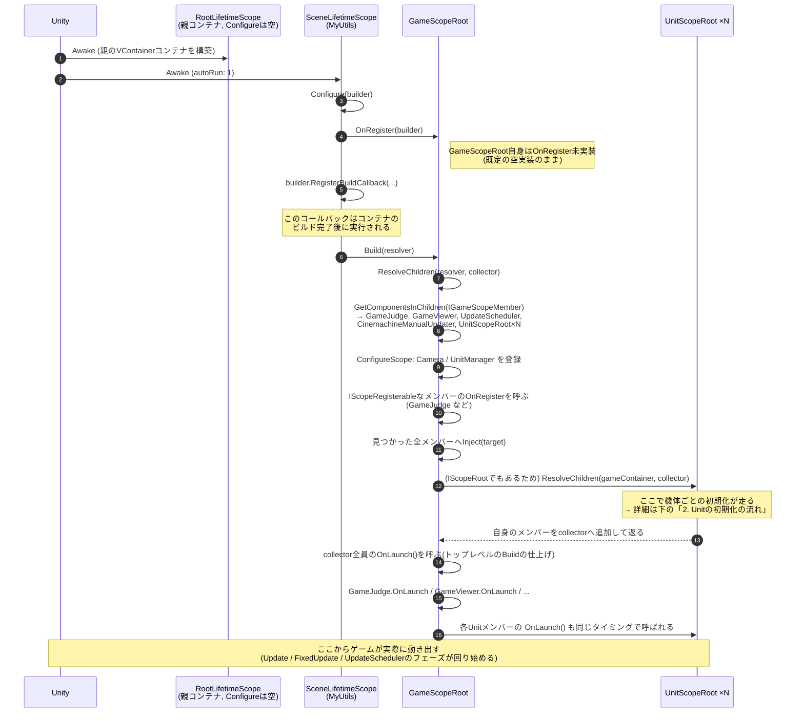
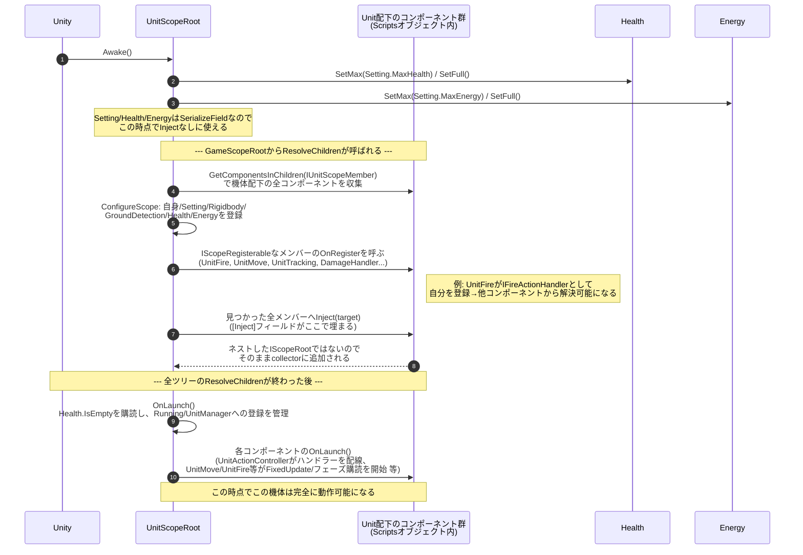

# 3DRobotGame 起動フロー図

クラスの静的な構造は [CLASS_DIAGRAM.md](CLASS_DIAGRAM.md)、設計思想の解説は
[ARCHITECTURE.md](ARCHITECTURE.md) を参照。このファイルは**時間の流れ**、
つまり「実際に何が何の順番で呼ばれるか」だけに絞った2枚の図。

## 1. ゲームの起動の流れ

シーンを再生してから、全コンポーネントの `OnLaunch()` が呼び終わるまでの流れ。

**ポイント**: 「登録+Inject解決」(`ResolveChildren`)と「OnLaunch実行」は完全に2段階に
分かれている。ツリー全体の依存解決が終わるまで、誰の`OnLaunch()`も呼ばれない。
そのため、ある`OnLaunch()`の中で「まだ`[Inject]`されていない依存」を参照してしまう
`NullReferenceException`が起きない。

## 2. Unitの初期化の流れ

上の図の「Units: ResolveChildren」1回分(機体1体分)を拡大したもの。

**ポイント**: `UnitScopeRoot`は「`GameScopeRoot`から見つかる`IGameScopeMember`」であると
同時に「`IUnitScopeMember`を探索する別のスコープルート」でもある(`AbstractScopeRoot<T>`の
入れ子)。そのため、機体固有の依存(`Rigidbody`/`UnitSetting`/`Health`/`Energy`など)は
機体ごとの子コンテナにしか登録されず、他の機体のコンポーネントから誤って解決されることはない。

---

PDF化する場合は、このファイルを VS Code の Markdown Preview Enhanced で開き、
「Chrome (Puppeteer) : Export PDF」を実行してください(横に長い図なので、必要であれば
[CLASS_DIAGRAM.md](CLASS_DIAGRAM.md)で紹介したA3横用紙のFront Matterも活用してください)。
